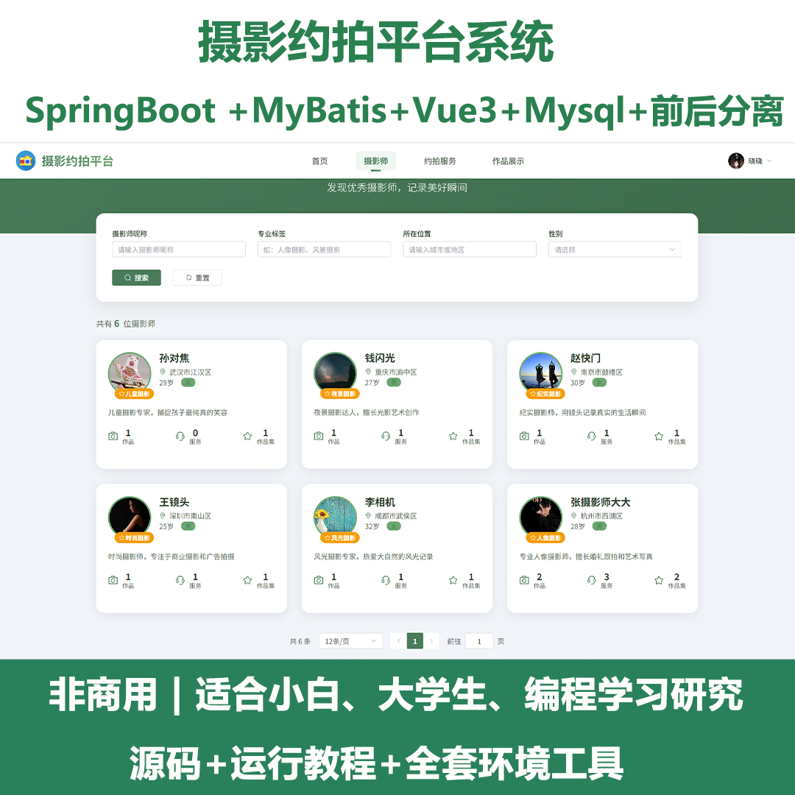
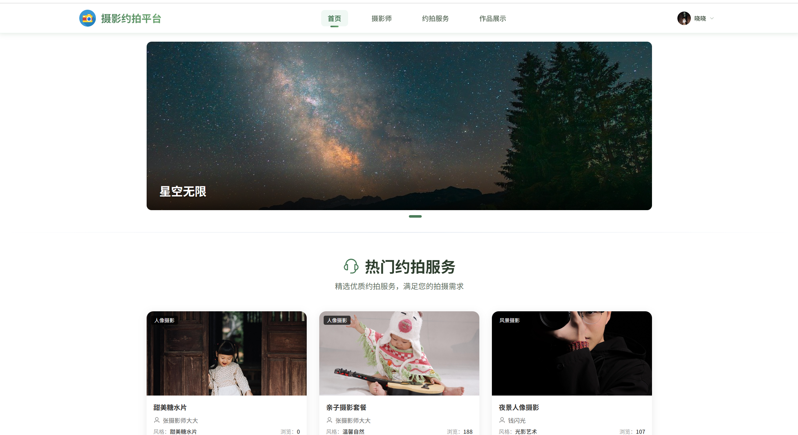
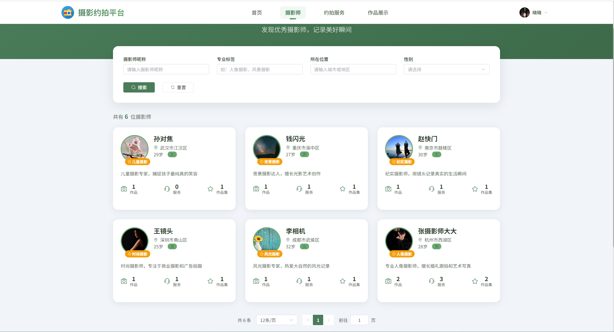
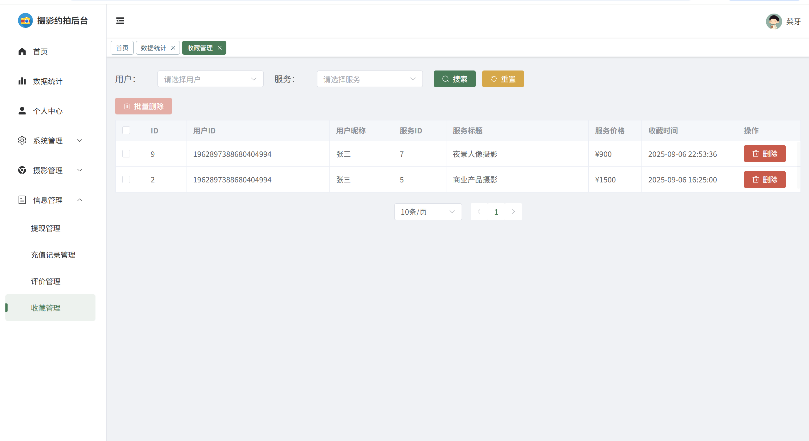
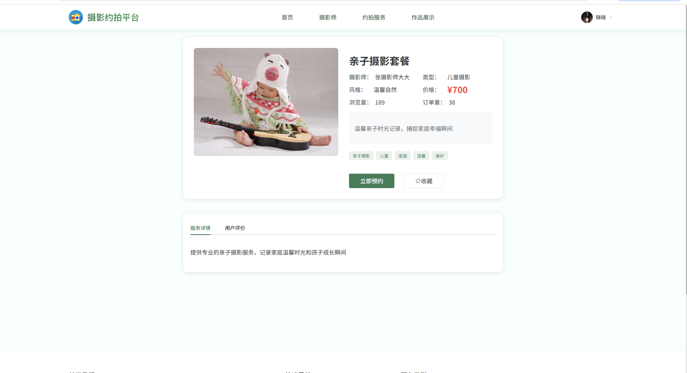
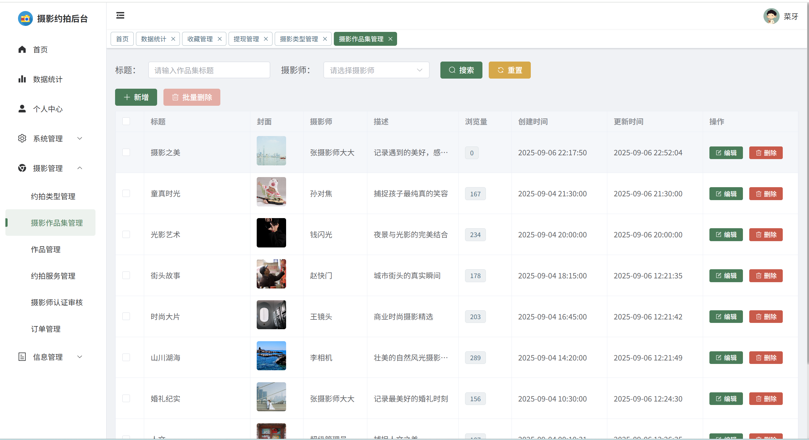
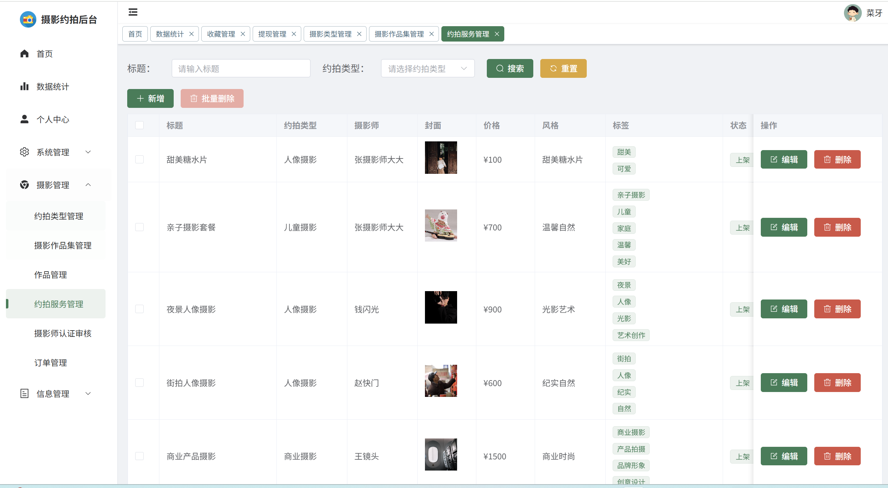
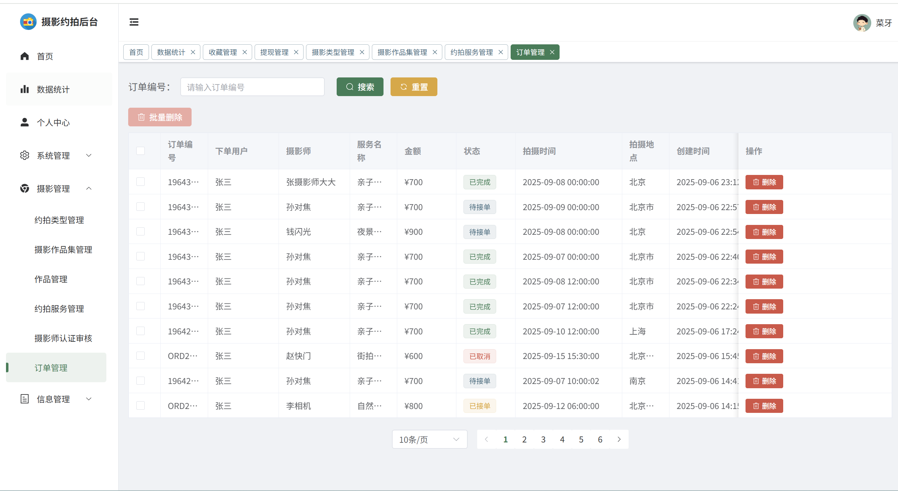
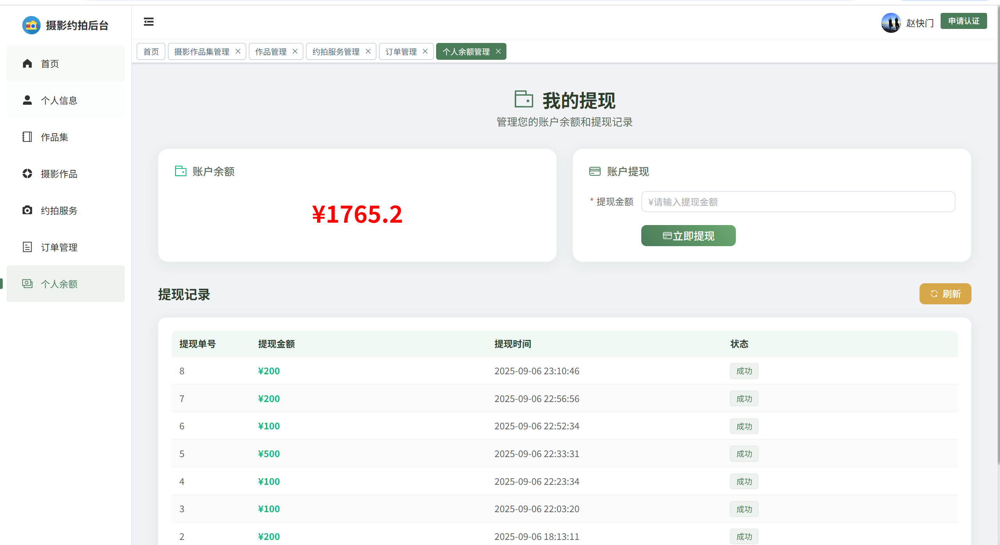

# springbootA542
springbootA542摄影约拍平台（Vue3
 
## 程序问题查看主页 

### 一、关键词

摄影约拍系统，摄影约拍平台

### 二、作品包含

源码+数据库+全套环境和工具资源+部署教程

### 三、项目技术

前端技术：Vue3 + ElementUI-Plus+ Axios + Pinia + Echarts
数据库：MySQL
后端技术：Java、SpringBoot + MyBatis-Plus + Satoken 

  

### 四、运行环境(以下版本亲测，其他版本未知，请自测)

开发工具：IDEA/eclipse  + vscode

数据库：MySQL8 

数据库管理工具：Navicat10以上版本

环境配置软件： JDK17 + Maven3.6.3

前端Nodejs：18

浏览器：谷歌浏览器

### 五、项目介绍

项目编号：springbootA542

摄影约拍平台是一个连接摄影师与客户的专业服务平台，提供从服务发布、预订、支付到完成的完整业务闭环。平台支持多角色管理，包括管理员、摄影师和普通用户三种角色。
管理员
- 系统管理权限
- 用户管理
- 内容审核
- 数据统计
- 平台运营

摄影师
- 服务发布
- 作品展示
- 订单处理
- 收入管理
- 认证申请

普通用户
- 服务浏览
- 在线预订
- 支付管理
- 评价反馈
- 收藏管理

### 六、运行截图

